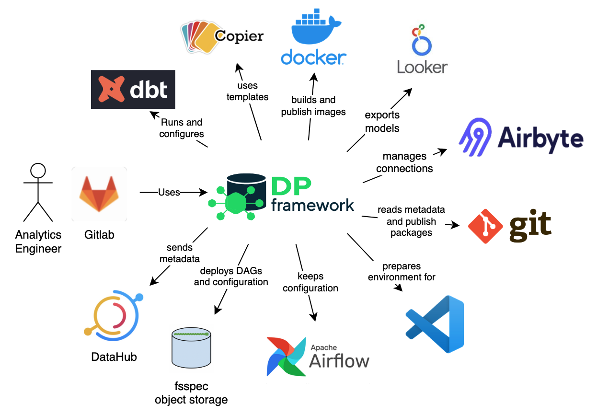

Integration with environment
======================

**Data Pipelines CLI** provides some sort of abstraction over multiple other components that take part in Data Pipeline
processes. The following picture presents the whole environment which is handled by our tool.

DBT
++++++++++++++++++++++++++++++++++++++++++++++

`DBT <https://www.getdbt.com/>` is currently the main tool that **DP** integrates with. The purpose of the **DP** tool is to cover DBT technicalities
including configuration and generates it on the fly whenever needed. At the same time, it gives more control over DBT
process management by chaining commands, interpolating configuration, and providing easy environments portability.

Copier
++++++++++++++++++++++++++++++++++++++++++++++

**DP** is heavily using `Copier <https://copier.readthedocs.io/en/stable/>` as templating tool. It gives a possibility to easily create new projects that are configured
automatically after a series of questions. It is also used to configure the working environment with required environment
variables.

Docker
++++++++++++++++++++++++++++++++++++++++++++++

One of the artifacts during building and publishing Data Pipelines are `Docker's <https://www.docker.com/>` images. Each
created image contains DBT with its transformation and scripts to run. Created images are environment agnostic and
can be deployed in any external configuration. Images are pushed to the selected Container Registry which configuration
should be taken from the environment (there should be a docker client configured).

Git
++++++++++++++++++++++++++++++++++++++++++++++

The `Data Pipelines CLI` can also publish created DBT packages for downstream usage into configured
`GIT <https://git-scm.com/>` repository. It uses key-based authentication where the key is provided as parameter `--key-path`

Airflow
++++++++++++++++++++++++++++++++++++++++++++++

**DP** doesn't communicate directly with Airflow, it rather sends artifacts to Object storage managed by Airflow and
`dbt-airflow-factory <https://dbt-airflow-factory.readthedocs.io/en/latest/>` library handles the rest. Created
projects keep DAG and configuration required to execute on the Airflow side.

Object storage
++++++++++++++++++++++++++++++++++++++++++++++

Configuration, Airflow DAG, and DBT manifest.json file are stored in Object storage for Airflow to be picked up and executed.
the **DP** uses `fsspec <https://filesystem-spec.readthedocs.io/en/latest/>` which gives a good abstraction over different
object storage providers. Currently, the tools were tested with GCS and S3.

DataHub
++++++++++++++++++++++++++++++++++++++++++++++

The `Data Pipelines CLI` is able to send data to `DataHub <https://datahubproject.io/>` based on a recipe in configuration.
The tool uses DataHub CLI under the hoot.

Visual Studio Code
++++++++++++++++++++++++++++++++++++++++++++++

`VS Code <https://code.visualstudio.com/>` is one of the recommended by us tools to work with DBT. **DP** tool simplify
integration of the created project with the `VS Code` plugin for DBT management.

Airbyte
++++++++++++++++++++++++++++++++++++++++++++++

Under development

Looker
++++++++++++++++++++++++++++++++++++++++++++++

Under development
