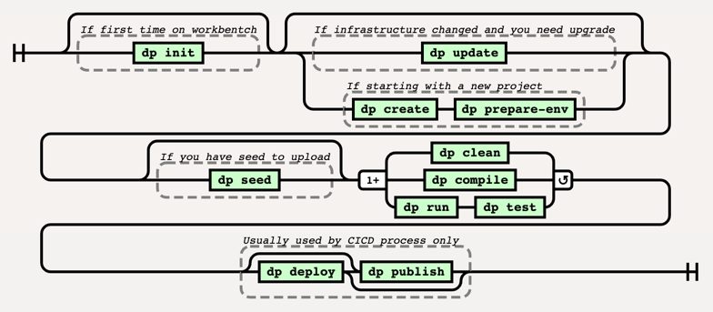
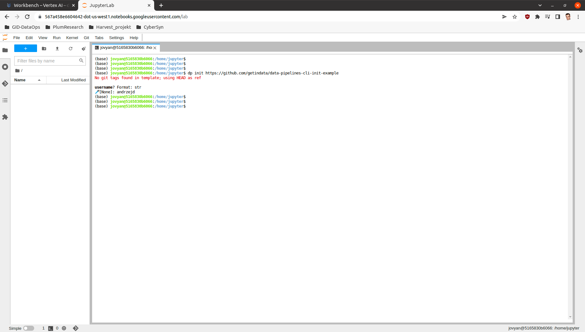
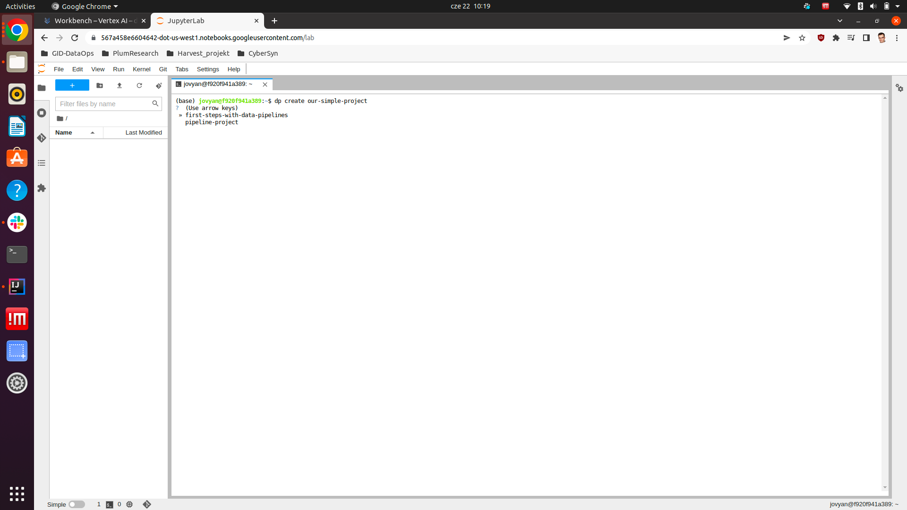
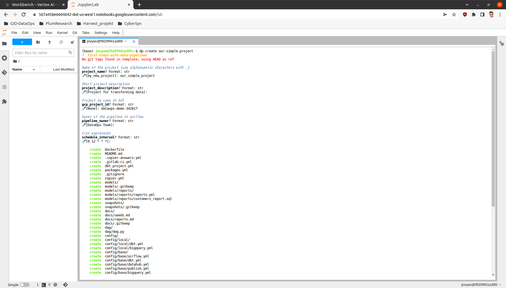
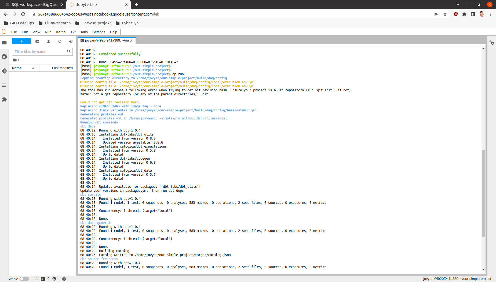
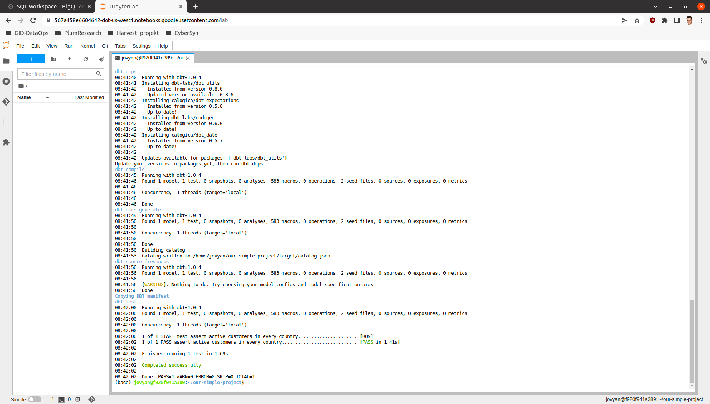

Usage
=====

This section is for ``Data Pipelines CLI``'s users. It will present how to use the tool and how it handles interaction
with the whole Data environment. Below diagram presents the sequence process how usually the toole is used and order in
which different commands are executed:

Preparing working environment
-------------------------

The first thing that needs to be done when starting Building Data Pipelines is to prepare the working environment. This step
can be done either on a local machine on any kind of Workbench (eg. JupyterLab). You will need a link from your
Data Engineer or Administrator to the template with initial configuration then, run ``dp init <CONFIG_REPOSITORY_URL>``
to initialize **dp**. You can also drop ``<CONFIG_REPOSITORY_URL>`` argument, **dp** will get initialized with an empty
config.

This step is done only the first time for each working environment you want to use.

Example:

In this example only one variable you will be asked for and it is going to be `username` which is used in many dp commands.

.. code-block:: bash

 dp init https://github.com/getindata/data-pipelines-cli-init-example

Project creation
----------------

You can use ``dp create <NEW_PROJECT_PATH>`` to choose one of the templates to create the project in the
``<NEW_PROJECT_PATH>`` directory.

You can also use ``dp create <NEW_PROJECT_PATH> <LINK_TO_TEMPLATE_REPOSITORY>`` to point directly to a template
repository. If ``<LINK_TO_TEMPLATE_REPOSITORY>`` proves to be the name of the template defined in **dp**'s config file,
``dp create`` will choose the template by the name instead of trying to download the repository.

After the template selection, you will be asked a series of predefined questions in the template.  Answering them all will cause
a new empty project to be generated. The project will be adjusted and personalized based on answers to the questions.

Example:

Following command starts project creation process.

.. code-block:: bash

 dp create our-simple-project

Fist step after this command is template selection:

We can switch options by pressing up and down buttons and we can make a decision by pressing enter.
After that, series of questions will be asked. Be aware that the name of the DP project should be composed of alpha-numeric
signs and the _ sign. After answering these questions the tool will generate complete project.

Adapting working environment to VSCode
-------------------------

VSCode is recommended tool to work with **dbt** as you can add a plugin that makes the work more efficient. To configure
the plugin or integrate it with some other standalone application you will need to generate ``profiles.yml`` file from the project.
``dp prepare-env`` prepares your local environment to be more conformant with standalone **dbt** requirements by saving
``profiles.yml`` in the home directory.

However, be aware that IDE usage is optional, and you can comfortably use ``dp run`` and ``dp test``
commands to interface with the **dbt** instead.

List all available templates
----------------

Execute ``dp template-list`` to list all added templates.

Project update
--------------

Whenever the template change you can update your project using ``dp update <PIPELINE_PROJECT-PATH>`` command.
It will sync your existing project with the updated template version selected by ``--vcs-ref`` option (default ``HEAD``).

It may be very useful when the are some infrastructure changes in your organization and you need to upgrade all created
projects (there can be hundreds of them).

Project compilation
-------------------

``dp compile`` prepares your project to be run on your local machine and/or deployed on a remote one.

Local run
---------

When you get your project created, you can run ``dp run`` and ``dp test`` commands.

* ``dp run`` runs the project on your local machine,
* ``dp test`` run tests for your project on your local machine.

Both commands accept ``--env`` parameter to select the execution environment. The default value is ``local``.

Example:

.. code-block:: bash

 dp run

This process will look at the contents of the models directory and create coresponding tables or views in data storage.

Now after all the tables and views are created we can also check, if the models work as intended by running the tests.

.. code-block:: bash

 dp test

dbt sources and automatic models creation
-------------------------------

With the help of `dbt-codegen <https://hub.getdbt.com/dbt-labs/codegen/>`_ and
`dbt-profiler <https://hub.getdbt.com/data-mie/dbt_profiler/>`_, one can easily generate ``source.yml``, source's base
model SQLs, and model-related YAMLs. **dp** offers a convenient CLI wrapper around those functionalities.

First, add the **dbt-codegen** package to your ``packages.yml`` file:

.. code-block:: yaml

 packages:
   - package: dbt-codegen
     version: 0.5.0  # or newer

Then, run ``dp generate source-yaml YOUR_DATASET_NAME`` to generate ``source.yml`` file in ``models/source`` directory.
You can list more than one dataset, divided by space. After that, you are free to modify this file.

When you want to generate SQLs for your sources, run ``dp generate source-sql``. It will save those SQLs in the directory
``models/staging/YOUR_DATASET_NAME``.

Finally, when you have all your models prepared (in the form of SQLs), run ``dp generate model-yaml MODELS_DIR`` to
generate YAML files describing them (once again, you are not only free to modify them but also encouraged to do so!).
E.g., given such a directory structure:

| models
| ├── staging
| │   └── my_source
| │       ├── stg_table1.sql
| │       └── stg_table2.sql
| ├── intermediate
| │   ├── intermediate1.sql
| │   ├── intermediate2.sql
| │   └── intermediate3.sql
| └── presentation
|     └── presentation1.sql
|

``dp generate model-yaml models/`` will create ``models/staging/my_source/my_source.yml``,
``models/staging/intermediate/intermediate.yml``, and ``models/presentation/presentation.yml``. Beware, however, this
command WILL NOT WORK if you do not have those models created in your data warehouse already. So remember to run
``dp run`` (or a similar command) beforehand.

If you add the **dbt-profiler** package to your ``packages.yml`` file too, you can call
``dp generate model-yaml --with-meta MODELS_DIR``. **dbt-profiler** will add a lot of profiling metadata to
descriptions of your models.

Project deployment
------------------

``dp deploy`` executes the deployment of a project. Depending on the configuration the command may execute different steps
described in this section. Please be aware that this command is meant for the CICD process and usually should be avoided as manual activity.

Blob storage synchronization
++++++++++++++++++++++++++++++++

The main action of the ``dp deploy`` command is synchronization with your bucket provider. The provider will be chosen automatically based on the remote URL.
Usually, it is worth pointing ``dp deploy`` to a JSON or YAML file with provider-specific data like access tokens or project
names. The *provider-specific data* should be interpreted as the ``**kwargs`` (keyword arguments) expected by a specific
`fsspec <https://filesystem-spec.readthedocs.io/en/latest/>`_'s FileSystem implementation. One would most likely want to
look at the `S3FileSystem <https://s3fs.readthedocs.io/en/latest/api.html#s3fs.core.S3FileSystem>`_ or
`GCSFileSystem <https://gcsfs.readthedocs.io/en/latest/api.html#gcsfs.core.GCSFileSystem>`_ documentation.

E.g., to connect with Google Cloud Storage, one should run:

.. code-block:: bash

 echo '{"token": "<PATH_TO_YOUR_TOKEN>", "project_name": "<YOUR_PROJECT_NAME>"}' > gs_args.json
 dp deploy --dags-path "gs://<YOUR_GS_PATH>" --blob-args gs_args.json

However, in some cases, you do not need to do so, e.g. when using **gcloud** with properly set local credentials. In such
a case, you can try to run just the ``dp deploy --dags-path "gs://<YOUR_GS_PATH>"`` command and let ``gcsfs`` search for
the credentials.
Please refer to the documentation of the specific ``fsspec``'s implementation for more information about the required
keyword arguments.

You can also provide your path in the ``config/base/airflow.yml`` file, as a ``dags_path`` argument:

.. code-block:: yaml

 dags_path: gs://<YOUR_GS_PATH>
 # ... rest of the 'airflow.yml' file

In such a case, you do not have to provide a ``--dags-path`` flag, and you can just call ``dp deploy`` instead.

Docker image
++++++++++++++++++++++++++++++++

``dp deploy`` command builds Docker image with **dbt** and project and sends it go Docker Registry. Docker registry may be
configured via Environment Variables (eg. DOCKER_AUTH_CONFIG) and the image repository can be configured in
``execution_env.yml`` file. Use ``--docker-push`` flag to enable docker pushing during deployment.

DataHub synchronization
++++++++++++++++++++++++++++++++

The deployment also sends metadata to ``DataHub`` based on receipt created in ``datahub.yml`` file. Use ``--datahub-ingest``
flag to enable DataHub synchronization.

Packing and publishing
----------------------

Sometimes there is a need to reuse data created in other projects and/or by a different team. The built project can be
converted to a **dbt** package by calling ``dp publish``. ``dp publish`` parses ``manifest.json``
and prepares a package from the presentation layer. It lists models created by transformations and they usually are a final product of a project. The models are prepared in form of **dbt** sources. Created metadata files are saved in the ``build/package`` directory and sent to a git repository
configured in ``publish.yml`` file.

Publication repo usually is private for a company and appropriate permissions are required. We recommend key-based
communication. You can use ``--key-path`` as a parameter to point to the key file with push permissions.

Using published sources
++++++++++++++++++++++++++++++++

Published packages can be used as standard **dbt** packages by adding them in ``packages.yml`` in the following form:

.. code-block:: yaml

 packages:
  - git: "https://{{env_var('DBT_GIT_USER_NAME', '')}}:{{env_var('DBT_GIT_SECRET_TOKEN', '')}}@gitlab.com/<path to you repository>"
    subdirectory: "<upstream project name>"

Dependencies metadata
++++++++++++++++++++++++++++++++

Created metadata files containing extra information about the project name (which can be also Airflow DAG name).

.. code-block:: json

 "source_meta": {
    "dag": "<project name>"
 }

This way explicit dependencies can be created in the execution environment. For more information see the documentation of
`dbt-airflow-factory <https://dbt-airflow-factory.readthedocs.io/en/latest/features.html#source-dependencies>`

Clean project
-------------

If needed call ``dp clean`` to remove compilation-related directories.

Load seed
-------------

One can use ``dp seed`` to load seeds from the project. Use ``--env`` to choose a different environment.

Serve documentation
-------------

dbt creates quite good documentation and sometimes it is useful to expose them to your coworkers on a custom port. To do that you can run
``dbt docs --port <port>`` command.
